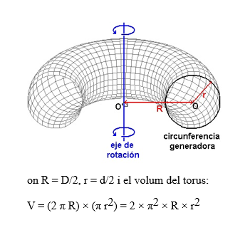

## Parte 1.1. Ejercicios de clases

### Primero: Coche 
1. **Crea una clase Coche**
La clase debe tener los atributos modelo y matrícula junto con sus métodos set y get correspondientes.
Crea otra clase llamada CocheTest con un método main que cree dos objetos de tipo Coche y pruebe sus métodos set y get.
2. **Crea una clase PermisoConducir**
Atributos: nombre, tipoPermiso y puntos.
Métodos: incluye los métodos set y get para cada atributo.
Agrega un método llamado imprimirPermiso que imprima por pantalla todos los atributos.
Agrega un método llamado restarPuntos que reste al total de puntos el número recibido como parámetro.
Crea otra clase llamada PermisoTest con un main que cree dos objetos de tipo PermisoConducir y pruebe los métodos set, imprimirPermiso y restarPuntos.
3. **Crea una clase CochePermiso**
Método main que haga lo siguiente:
Crear un objeto de la clase Coche y otro de la clase PermisoConducir.
Mostrar un menú con las opciones: 
- a) Modificar información del coche: actualiza el objeto Coche con nuevos datos (modelo y matrícula) solicitados al usuario. 
- b) Modificar información del permiso: actualiza el objeto PermisoConducir con nuevos datos (nombre, tipoPermiso, puntos) solicitados al usuario. 
- c) Mostrar información: muestra todos los valores de los atributos de los objetos Coche y PermisoConducir.

### Segundo: Preguntas 
```java
public class AlumnoTest {
public static void main(String[] args) {
Alumno alumno1 = null;
Alumno alumno2 = null;
Alumno alumno3 = null;

        alumno1 = new Alumno();
        alumno1.setNombre("Ramón");

        alumno2 = new Alumno();
        alumno2.setNombre("Sonia");

        alumno3 = alumno1;
        alumno3.saluda();
        alumno1.saluda();

        alumno1 = alumno2;
        alumno1.saluda();

        alumno2.setNombre("Moncho");

        alumno1.saluda();
    }
}
```
**Responde**
- **¿Cuántos objetos Alumno se crean en el programa?**

Se crean 3 variables de objeto Alumno, pero no se inicializan todas, solamente 2 nuevos objeto Alumno.
```
    alumno1 = new Alumno();
    alumno1.setNombre("Ramón");
    alumno2 = new Alumno();
    alumno2.setNombre("Sonia");
```
- **¿Las asignaciones entre variables del tipo Alumno (por ejemplo, alumno3 = alumno1) hacen una copia del objeto?**

No hacen una copia del objeto, asigna la nueva direccion del objeto que apunta, un ejemplo alumno3 = alumno1 la direccion que apuntaba alumno 3 ahora seria
a la direccion de alumno1.
- **¿Estas asignaciones hacen que ambas variables apunten al mismo objeto?**

Si estarian apuntando a la misma referencia del Objeto.

### Tercero : Triangulo

1. Crea y prueba una clase que modele un triángulo

* **Atributos**: lado1, lado2, lado3: longitudes de los lados del triángulo (números reales).
* **Métodos**:

**Constructor por defecto**: los lados tendrán valores 3, 4 y 5.

**Constructor que reciba los valores de los lados como parámetros**

**Método perimetro()**: calcula el perímetro del triángulo.

**Método area()**: calcula el área usando la fórmula de Herón. Referencia.


### Cuatro: Contadores

1. **Crea y prueba una clase que emule un contador cíclico de un dígito (0-9)**
- **Métodos**: restablecer el contador a 0, incrementarlo y consultar su valor.

2. **Extiende el contador cíclico a dos dígitos (0-99)**
- Usa la clase del ejercicio anterior.


### Cinco: Game

1. **Crea y prueba las clases Position y Player**
2. **Clase Position**
- Representa un punto (x, y) en un plano cartesiano.
- Métodos: constructor por defecto (0, 0), constructor con parámetros (x, y), getters, setters, incrementos y decrementos para las coordenadas (incX, incY, decX, decY) y un método setXY.
3. **Clase Player**
- Representa un jugador con posición (Position) y nombre.
- Métodos: constructor que reciba posición inicial, mover el jugador (moveRight, moveLeft, jump, fall), getters y setters para el nombre y posición.
4. Crea una clase **Game** con un menú basado en la clase Player:

**Menú de opciones**

- a) Añadir nuevo jugador: crea un nuevo objeto Player solicitando al usuario el nombre y coordenadas iniciales.
- b) Eliminar jugador: elimina el último jugador creado.
- c) Reiniciar partida: elimina todos los jugadores creados.
- d) Mostrar jugadores: imprime la información de todos los jugadores.

_Nota: Usa un vector de hasta 10 jugadores. Si el vector está lleno y se intenta añadir otro jugador, muestra un error._

### Seis: Geometria

1. Crea una clase Círculo 
- Atributos: radio.
- Métodos: calcular perímetro, área y comparar qué círculo es mayor.
2. Crea una clase Cilindro
- Atributos: radio de la base y altura.
- Métodos: calcular área total, volumen y comparar qué cilindro es mayor usando la clase **Círculo**.
3. Crea una clase Anillo
- Atributos: modelo, diámetro de paso del dedo (D) en mm y diámetro de la sección del anillo (d) en mm, .
- Cálculos:
  - Peso del anillo.
  - Precio del oro: 10 €/g.
  - El peso especifico del oro es 19,3 gr/cm^3
  - Coste total de fabricación: 40 €.
  - Precio de venta: margen del 210 % sobre el coste total.
  - Fórmula del volumen del toroide: 

.


